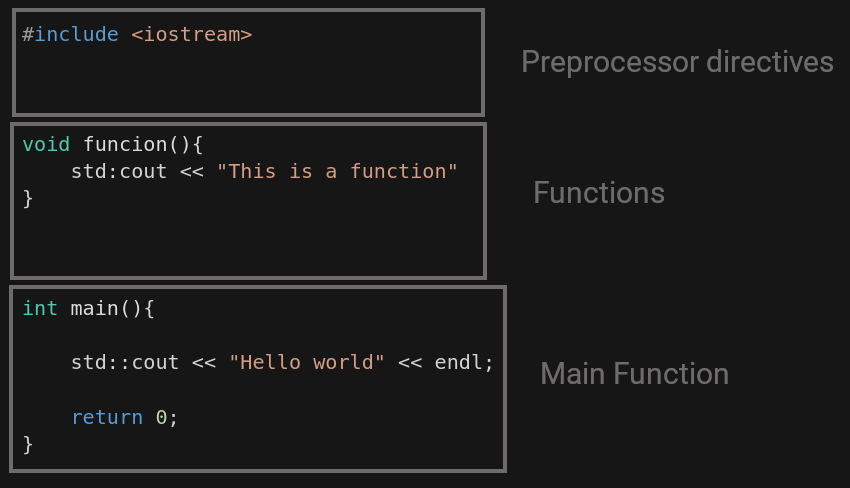

# Program structure in C++

Main program structure in c++


<div align ="center">

</div>

## Preprocessor directives
Preprocessing directives are always processed before the program is compiled. They start with "#" symbol.

```c++
#include <iostream>
```
In this case, the preprocessing directive include the iostream library wich is used to control the input/output stream header.

## Main Function

C++ programs consist in one or more functions that are executed when they are called. When the program is executed the main function is the first function called.

```c++
int main(){
    std::cout << "Hello World";
    return 0;
}
```
